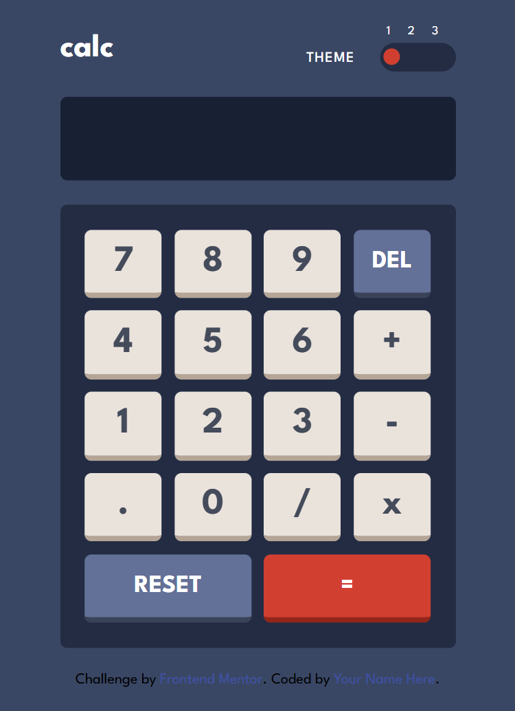

# Frontend Mentor - Calculator app solution

This is a solution to the [Calculator app challenge on Frontend Mentor](https://www.frontendmentor.io/challenges/calculator-app-9lteq5N29). Frontend Mentor challenges help you improve your coding skills by building realistic projects. 

## Table of contents

- [Overview](#overview)
  - [The challenge](#the-challenge)
  - [Screenshot](#screenshot)
  - [Links](#links)
- [My process](#my-process)
  - [Built with](#built-with)
  - [What I learned](#what-i-learned)
  - [Continued development](#continued-development)
  - [Useful resources](#useful-resources)
- [Author](#author)

## Overview

### The challenge

Users should be able to:

- View the optimal layout for the site depending on their device's screen size
- See hover states for all interactive elements on the page

### Screenshot

### Links

- Solution URL: [Add solution URL here](https://github.com/DHBLee/DHBLee3/tree/DHBLee/Fronend-Mentor/Calcu)
- Live Site URL: [Add live site URL here](https://dhb-lee3-7b86.vercel.app/)

## My process
 - HTML Structure
 - CSS Style
 - JS Flow
 - HTML/CSS Improvement

### Built with

- Semantic HTML5 markup
- CSS custom properties
- Flexbox
- CSS Grid
- SCSS
- Mobile-first workflow
- JS

### What I learned
  I learned more about JS

### Continued development
  Better, More efficient, Scalable Code in the future

### Useful resources

- [Example resource 1](https://www.chatgpt.com) - Of Cos!

## Author

[@DHBLee](https://www.frontendmentor.io/profile/DHBLee)
