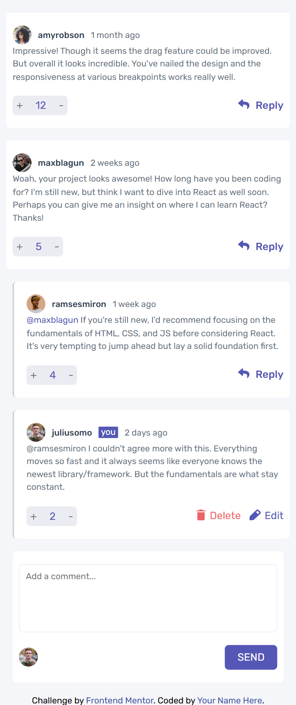

# Frontend Mentor - Interactive comments section solution

This is a solution to the [Interactive comments section challenge on Frontend Mentor](https://www.frontendmentor.io/challenges/interactive-comments-section-iG1RugEG9). Frontend Mentor challenges help you improve your coding skills by building realistic projects. 

## Table of contents

- [Overview](#overview)
  - [The challenge](#the-challenge)
  - [Screenshot](#screenshot)
  - [Links](#links)
- [My process](#my-process)
  - [Built with](#built-with)
  - [What I learned](#what-i-learned)
  - [Continued development](#continued-development)
  - [Useful resources](#useful-resources)
- [Author](#author)

## Overview

### The challenge

Users should be able to:

- View the optimal layout for the site depending on their device's screen size
- See hover states for all interactive elements on the page

### Screenshot

### Links

- Solution URL: [Add solution URL here](https://github.com/DHBLee/DHBLee3/tree/DHBLee/Fronend-Mentor/Interactive)
- Live Site URL: [Add live site URL here](https://dhb-lee3-6j2o-l7pcifomu-dhblees-projects.vercel.app/)

## My process

### Built with

- Semantic HTML5 markup
- CSS custom properties
- Flexbox
- SCSS
- Mobile-first workflow
- JS

### What I learned

Learned a lot about JS

### Continued development

fix my JS code and really implement all the said features of this challenge

### Useful resources

- [Example resource 1](https://www.chatgpt.com) - yes..

## Author

[@DHBLee](https://www.frontendmentor.io/profile/DHBLee)
