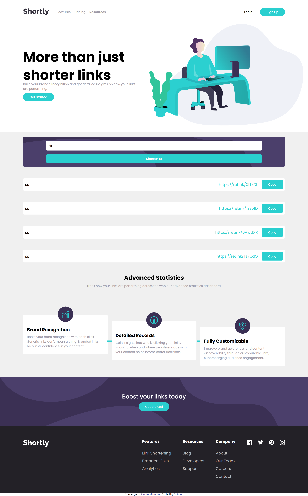
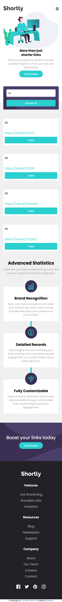

# Frontend Mentor - Shortly URL shortening API Challenge solution

This is a solution to the [Shortly URL shortening API Challenge challenge on Frontend Mentor](https://www.frontendmentor.io/challenges/url-shortening-api-landing-page-2ce3ob-G). Frontend Mentor challenges help you improve your coding skills by building realistic projects. 

## Table of contents

- [Overview](#overview)
  - [The challenge](#the-challenge)
  - [Screenshot](#screenshot)
  - [Links](#links)
- [My process](#my-process)
  - [Built with](#built-with)
  - [What I learned](#what-i-learned)
  - [Continued development](#continued-development)
  - [Useful resources](#useful-resources)
- [Author](#author)

## Overview

### The challenge

Users should be able to:

- View the optimal layout for the site depending on their device's screen size
- See hover states for all interactive elements on the page

### Screenshot

### Links

- Solution URL: [Add solution URL here](https://github.com/DHBLee/DHBLee3/tree/DHBLee/Fronend-Mentor/URL/url-shortening-api-master)
- Live Site URL: [Add live site URL here](https://dhb-lee3-rvpp.vercel.app/)

## My process

HTML strucutre
CSS Styling
JS algorithms
Fixes HTMl and CSS Structure
Finish :D

### Built with

- Semantic HTML5 markup
- CSS custom properties
- Flexbox
- CSS Grid
- Mobile-first workflow
- JS

### What I learned

I learned more about pseudo classes as I relied on it to target specific elements that have the same class or elements. For this project, I didn't try to use classes for some elements, that's why I had to rely on pseudo classes for it.

### Continued development

Cleaner, more efficient, and scalable codes in the future.

### Useful resources

- [Example resource 1](https://www.chatgpt.com) - Of cos!

## Author

[@DHBLee](https://www.frontendmentor.io/profile/DHBLee)